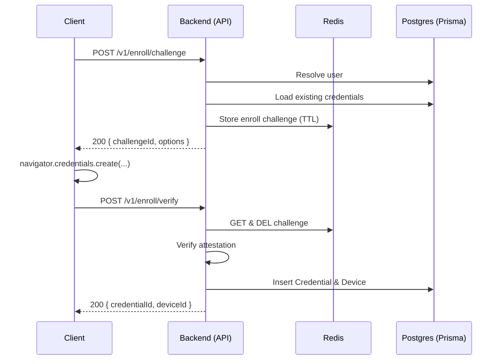
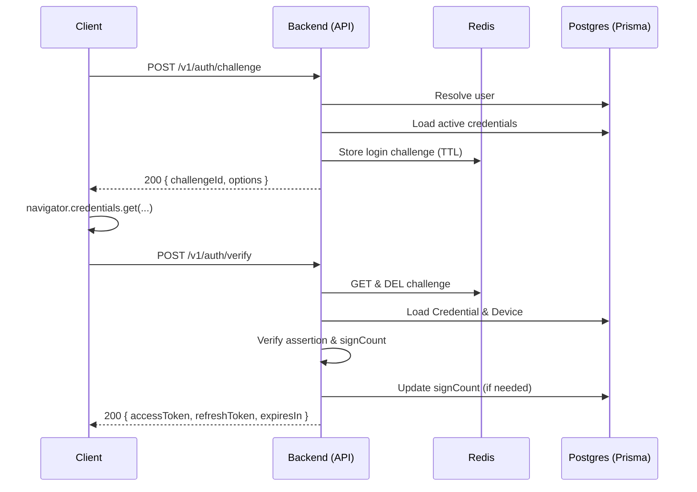
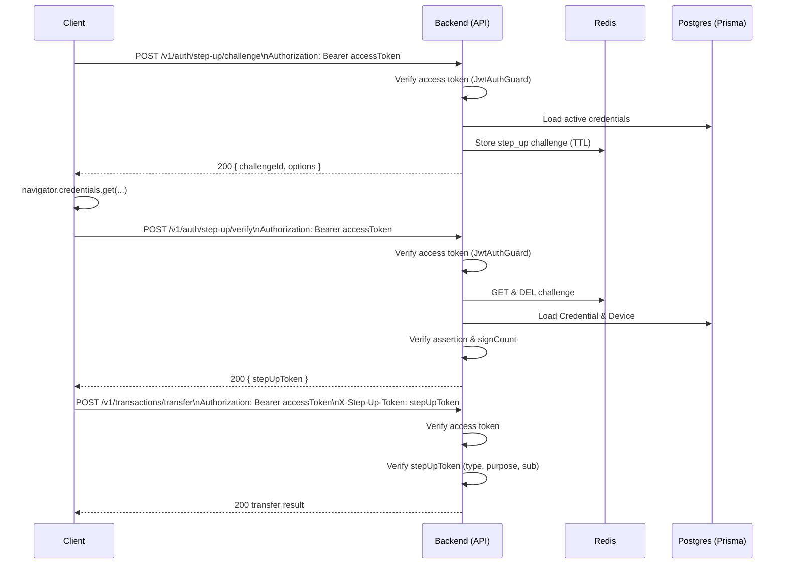

# Biometric Auth – Flows

This document describes the end‑to‑end flows for WebAuthn enrollment, biometric login, and step‑up authentication, including how Redis, Prisma, and existing auth modules interact.

## Actors & Components

- **Client**
  - Web or mobile app that talks to the backend and interacts with the browser/native WebAuthn APIs.
- **Backend**
  - NestJS app exposing `/v1` routes.
  - Modules:
    - `AuthPasswordModule` – email/password login and tokens.
    - `EnrollmentModule` – WebAuthn registration (create).
    - `AuthModule` – biometric login and step‑up.
    - `DevicesModule` – device management (future).
    - `WebAuthnModule` – helper for WebAuthn options/verification.
- **Prisma (Postgres)**
  - Stores `User`, `Credential`, `Device`, and existing token tables.
- **Redis**
  - Stores WebAuthn challenges and drives rate limiting.

---

## 1. Enrollment Flow (Add Biometric Device)

Enrollment links a WebAuthn authenticator to an existing user account. It is typically initiated while the user is logged in with email/password.

### 1.1 Preconditions

- User account exists and is email‑verified.
- User is authenticated with a valid access token (recommended), or provides a trusted identifier such as email (minimum).

### 1.2 Sequence – High Level



1. **Client** (logged‑in user) chooses “Add biometric device”.
2. **Client → Backend** `POST /v1/enroll/challenge`
   - Body:
     - Option A: `{ email }` (the account email).
     - Option B (preferred): empty body; backend resolves the user from the Bearer token.
3. **Backend**
   - Resolves `userId` from email or access token.
   - Loads existing, active credentials for the user.
   - Uses `WebAuthnService` to generate **registration options** (`PublicKeyCredentialCreationOptions`).
   - Generates a `challengeId` and stores a Redis record:
     - Key: `webauthn:enroll:challenge:{challengeId}`.
     - Value:
       ```json
       {
         "context": "enroll",
         "userId": "...",
         "email": "...",
         "publicKeyCredentialCreationOptions": { ... },
         "createdAt": 1710000000000
       }
       ```
     - TTL: 2–5 minutes.
   - Optionally rate limits enrollment requests per user/IP.
   - Returns `{ challengeId, publicKeyCredentialOptions }` in the envelope.
4. **Client**
   - Calls `navigator.credentials.create({ publicKey: publicKeyCredentialOptions })`.
   - Receives a WebAuthn attestation response.
5. **Client → Backend** `POST /v1/enroll/verify`
   - Body:
     ```json
     {
       "challengeId": "uuid",
       "credential": {
         "id": "...",
         "rawId": "...",
         "response": { ... },
         "type": "public-key",
         "clientExtensionResults": { ... }
       }
     }
     ```
6. **Backend**
   - Loads and immediately deletes the Redis record for `challengeId`.
   - If missing/expired:
     - Returns 404 with an `ErrorCode` such as `CHALLENGE_EXPIRED`.
   - Uses `WebAuthnService` to verify the attestation:
     - Confirms challenge, origin, RP ID, and signature.
   - On success:
     - Extracts `credentialId`, `publicKey`, `signCount`, `aaguid`, `transports`.
     - Checks for an existing `Credential` with the same `credentialId`:
       - If one exists for a **different** user → 409 CONFLICT.
     - Creates a new `Credential` row for the user.
     - Creates a `Device` row wrapping that credential (with metadata like label or platform).
   - Returns `{ credentialId, deviceId }` in `data`.

### 1.3 Failure & Recovery

- If enrollment verification fails (attestation invalid, expired challenge, etc.):
  - No credential/device is created.
  - The user remains logged in via password and can retry enrollment.
- If the same credential is re‑submitted for the same user:
  - Implementation can treat this as idempotent or as a conflict, depending on policy.

---

## 2. Password Login Flow (Baseline)

This flow already exists and is the foundation for managing biometric devices.

1. **Client → Backend** `POST /v1/auth/password/login`
   - Body: `{ email, password }`.
2. **Backend**
   - Verifies credentials and `emailVerified`.
   - Issues:
     - Access token (`type: "access"`, `sub: userId`).
     - Refresh token, persisted via `RefreshToken` table.
     - Optional claims describing authentication method and timestamp.
3. **Client**
   - Stores tokens securely (e.g., HTTP‑only cookie / secure storage).
   - Uses access token for subsequent API requests.

Password login always remains available, even if all biometric devices are revoked or blocked.

---

## 3. Biometric Login Flow (Passwordless Option)

Biometric login allows a user to authenticate using WebAuthn instead of password. If it fails, the client should offer password login as a fallback.

### 3.1 Challenge



1. **Client** chooses “Login with biometric”.
2. **Client → Backend** `POST /v1/auth/challenge`
   - Body: `{ email }` or `{ userId }`.
3. **Backend**
   - Resolves user.
   - Ensures the user has at least one active `Credential`+`Device`.
   - Uses `WebAuthnService` to generate authentication options (`PublicKeyCredentialRequestOptions`).
   - Creates Redis record:
     - Key: `webauthn:auth:challenge:{challengeId}`.
     - Value:
       ```json
       {
         "context": "login",
         "userId": "...",
         "allowedCredentialIds": ["..."],
         "publicKeyCredentialRequestOptions": { ... },
         "createdAt": ...
       }
       ```
   - Returns `{ challengeId, publicKeyCredentialOptions }`.

### 3.2 Verify

1. **Client**
   - Calls `navigator.credentials.get({ publicKey: publicKeyCredentialOptions })`.
   - Sends result to `POST /v1/auth/verify` with `{ challengeId, credential }`.
2. **Backend**
   - Loads and deletes Redis challenge.
   - Ensures `context === "login"`.
   - Resolves user from the challenge record.
   - Loads the referenced `Credential`+`Device`:
     - Must be active and not revoked.
   - Uses `WebAuthnService` to verify the assertion (challenge, origin, RP ID, signature).
   - Applies signCount logic (see security document):
     - On regression, revokes the credential and rejects the login.
   - On success:
     - Issues access/refresh tokens via the shared token issuance service.
     - Records that this login was performed via WebAuthn (claims or logs).
3. **Client**
   - Stores tokens as with password login.
   - If biometric login fails, falls back to `auth/password/login`.

---

## 4. Step‑Up Authentication Flow (Sensitive Operations)

Step‑up authentication enforces a fresh biometric assertion **on top of** an existing session. It produces a short‑lived, purpose‑scoped token that sensitive endpoints can require.



### 4.1 Preconditions

- User is already authenticated with an access token (via password or biometric login).
- Client wants to perform a sensitive operation (e.g., transfer funds, export PII).

### 4.2 Step‑Up Challenge

1. **Client** prepares to perform a sensitive operation.
2. **Client → Backend** `POST /v1/auth/step-up/challenge`
   - Headers: `Authorization: Bearer <accessToken>`.
   - Body: `{ purpose?: string }` (optional but recommended, e.g. `"transaction:transfer"`).
3. **Backend**
   - `JwtAuthGuard` validates access token and extracts `userId`.
   - Optionally checks session recency.
   - Loads active credentials/devices for the user.
   - Generates WebAuthn authentication options.
   - Stores Redis record:
     - Key: `webauthn:auth:challenge:{challengeId}`.
     - Value:
       ```json
       {
         "context": "step_up",
         "userId": "...",
         "purpose": "transaction:transfer",
         "publicKeyCredentialRequestOptions": { ... },
         "createdAt": ...
       }
       ```
   - Returns `{ challengeId, publicKeyCredentialOptions }`.

### 4.3 Step‑Up Verify (Step‑Up Token)

1. **Client**
   - Calls `navigator.credentials.get({ publicKey: publicKeyCredentialOptions })`.
   - Sends result to `POST /v1/auth/step-up/verify`.
   - Headers: `Authorization: Bearer <accessToken>`.
   - Body: `{ challengeId, credential }`.
2. **Backend**
   - `JwtAuthGuard` validates access token and gets `userIdFromToken`.
   - Loads and deletes Redis challenge.
   - Validates:
     - `context === "step_up"`.
     - `challenge.userId === userIdFromToken`.
   - Loads `Credential`+`Device` and verifies assertion as in biometric login.
   - On success:
     - Issues a short‑lived **step‑up token** via `TokenService`:
       - Claims (example):
         - `type: "step_up"`
         - `sub: userId`
         - `purpose: challenge.purpose`
         - `challengeId`
         - `exp: now + N seconds` (e.g., 60–120s).
     - Returns `{ stepUpToken }` in `data`.
3. **Client**
   - Immediately uses the `stepUpToken` for the sensitive operation (or discards it if the action is canceled).

### 4.4 Using Step‑Up Token on Sensitive Endpoints

1. **Client → Backend** (example) `POST /v1/transactions/transfer`
   - Headers:
     - `Authorization: Bearer <accessToken>`.
     - `X-Step-Up-Token: <stepUpToken>` (or body field).
2. **Backend**
   - Validates access token as usual.
   - Validates `stepUpToken`:
     - Signature and expiry.
     - `type === "step_up"`.
     - `sub` matches `accessToken.sub`.
     - `purpose` includes or matches a value allowed for this endpoint.
   - If valid, proceeds with the sensitive operation.
   - If invalid/missing/expired, returns 401/403 as appropriate.

This model scopes the biometric proof to a specific action and time window, rather than upgrading the entire session.

---

## 5. Device Management Flow (Future)

A dedicated devices module will allow users to inspect and manage their enrolled devices.

### 5.1 List Devices

1. **Client → Backend** `GET /v1/devices`
   - Headers: `Authorization: Bearer <accessToken>`.
   - Query: pagination via `PageQueryDto`.
2. **Backend**
   - Uses `JwtAuthGuard` to resolve `userId`.
   - Queries `Device` and joins `Credential` as needed.
   - Returns paginated list via `toPaginated(...)`, which is enveloped as `{ data, meta }`.

### 5.2 Revoke Device

1. **Client → Backend** `DELETE /v1/devices/{id}`
   - Headers: `Authorization: Bearer <accessToken>`.
   - Optional: require step‑up for certain revocations.
2. **Backend**
   - Ensures the device belongs to the authenticated user.
   - Marks `Device.active = false` and sets `deactivatedAt` and `deactivatedReason`.
   - Optionally sets `Credential.revoked = true` for that device.
   - Returns 204 No Content.

After revocation, biometric login and step‑up using that device’s credential will fail, while password login remains available.

---

## 6. Error & Fallback Scenarios

- **No Credentials for User**
  - Biometric login or step‑up challenge returns 404/`NO_CREDENTIALS`.
  - Client should guide user to log in with password and enroll a device.

- **Expired or Missing Challenge**
  - Any verify endpoint with an unknown `challengeId` returns 404/`CHALLENGE_EXPIRED`.
  - Client should restart the flow from the challenge endpoint.

- **Revoked or Compromised Credential**
  - Verification fails with 401 and an error code like `CREDENTIAL_REVOKED` or `CREDENTIAL_COMPROMISED`.
  - Client should:
    - Offer password login (if not already in a session).
    - Prompt user to manage devices and re‑enroll if needed.

- **Step‑Up Token Issues**
  - Missing or expired token on a sensitive endpoint:
    - Return 401/403, prompting the client to re‑run step‑up.
  - Mismatch between `sub` and access token:
    - Treat as an error and log for investigation.
